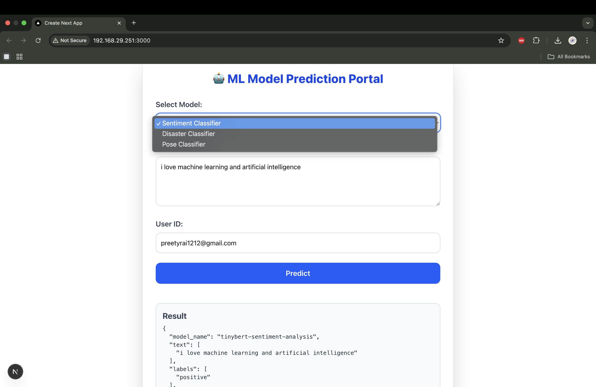

ML Backend (Hugging Face Transformers) + React Frontend



create a virual environment
 
conda activate /Users/preetyrai/fastapi_docker_nginx/venv

```bash
ssh -i "/Users/preetyrai/.ssh/mlops.pem" ubuntu@3.90.34.5

```

```bash
sudo crontab -e 

```

which python 

# for streamlit depyloyment
 @reboot /opt/conda/bin/python -m streamlit run /home/ubuntu/mlops/Sentiment_Analysis/app.py > /home/ubuntu/mlops/Sentiment_Analysis/streamlit.log 2>&1 


# for application deployment 

```bash
@reboot /opt/conda/bin/python -m streamlit run /home/ubuntu/mlops/FastAPI_Nginx_HuggingFaceTransfromers/app.py > /home/ubuntu/mlops/FastAPI_Nginx_HuggingFaceTransfromers/app.log 2>&1

```


# for docker

docker build -t fastapi .

docker run fastapi 


# Command to build and run docker image 
docker build -t mlops-nginx .

docker run -p 80:5000 mlops-nginx


# For pushing to Docker Hub 

docker tag mlops-nginx preetyrai1212/mlops-nginx:latest 

# to push to docker hub. we will use: 
docker push preetyrai1212/mlops-nginx:latest

# to pull docker image from docker hub


# command to run pulled image from docker hub 
docker run -p 80:5000 preetyrai1212/mlops-nginx


# docoker compose.yaml file 


docker-compose up --build --scale app=5 

docker-compose up --scale app=5


# docker two splitting images and push them separately to docker hub 
docker ps

docker tag fastapi_docker_nginx-nginx preetyrai1212/nginx:latest


docker tag fastapi_docker_nginx-app preetyrai1212/app:latest

docker push preetyrai1212/nginx

docker push preetyrai1212/app 

# Now we can do in 1 docker-compose.yaml file also : 
``` bash
services:
  app:
    image: preetyrai1212/app

    volumes:
      - ./.aws:/root/.aws:ro

  
  nginx:
    image: preetyrai1212/nginx

    depends_on:
      - app

    ports:
      - "80:80"

```
after that use: 
```bash
docker-compose up --build --scale app=5

``` 
or 

```bash
docker-compose up --build 

```


