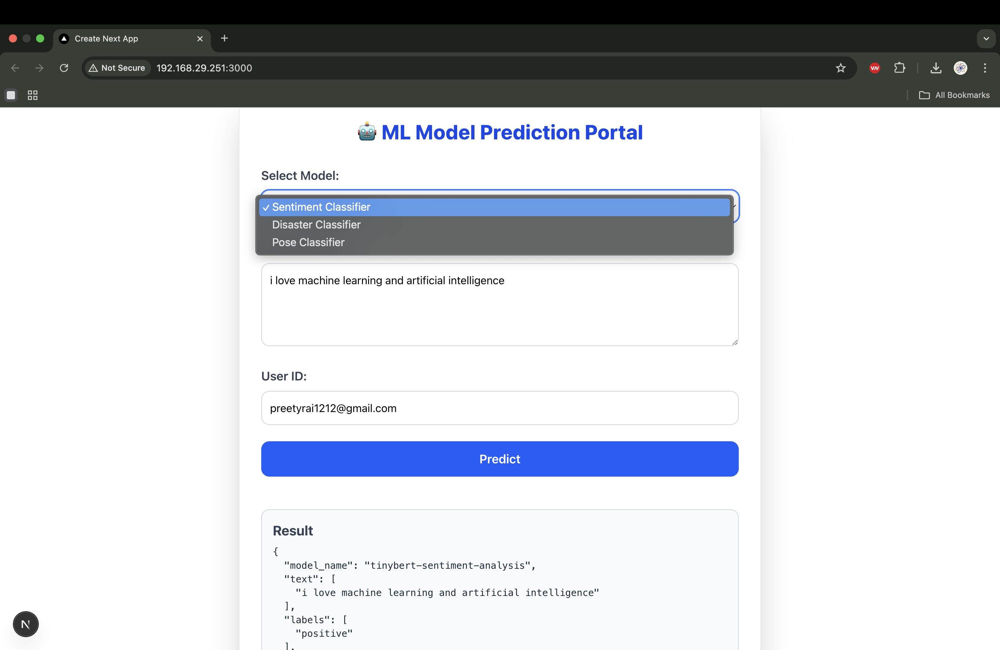

ML Backend (Hugging Face Transformers) + React Frontend

create a virual environment

ssh -i "/Users/preetyrai/.ssh/mlops.pem" ubuntu@3.90.34.5

sudo crontab -e 

 @reboot /opt/conda/bin/python -m streamlit run /home/ubuntu/mlops/Sentiment_Analysis/app.py > /home/ubuntu/mlops/Sentiment_Analysis/streamlit.log 2>&1 

 